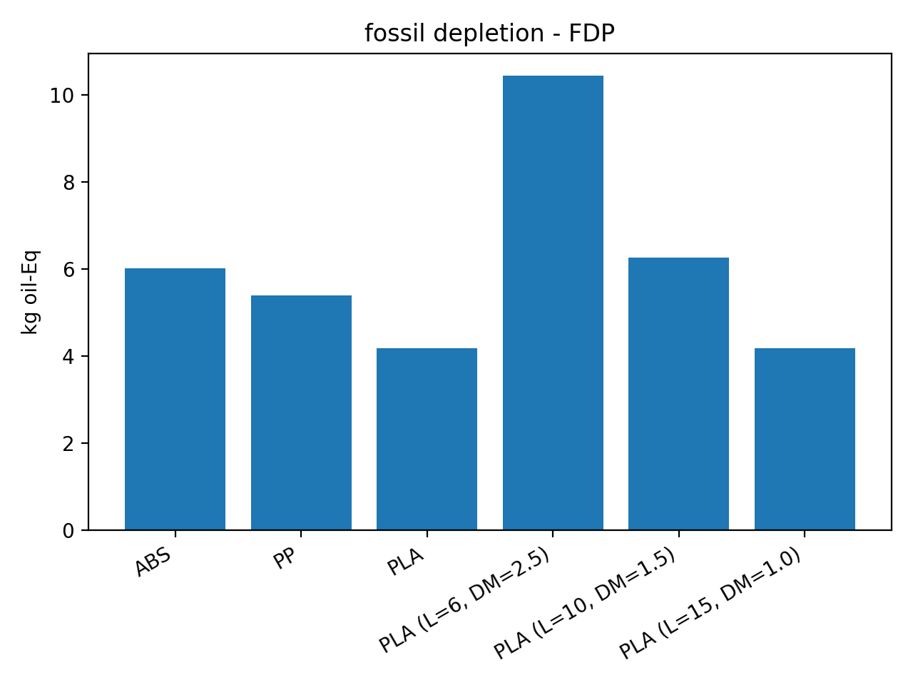
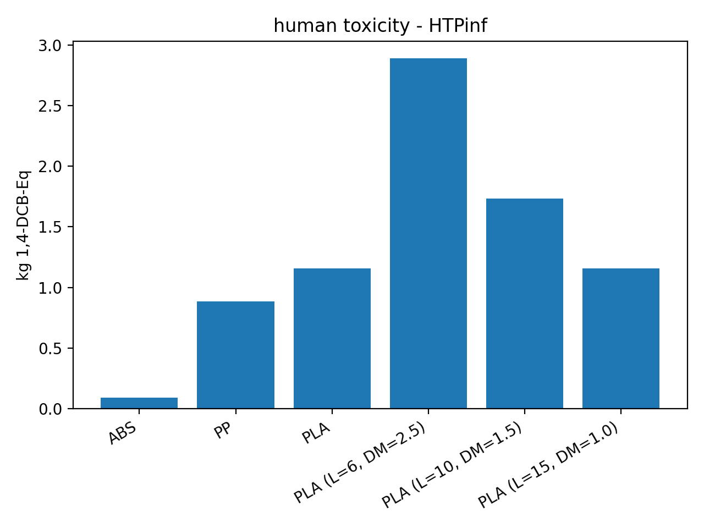
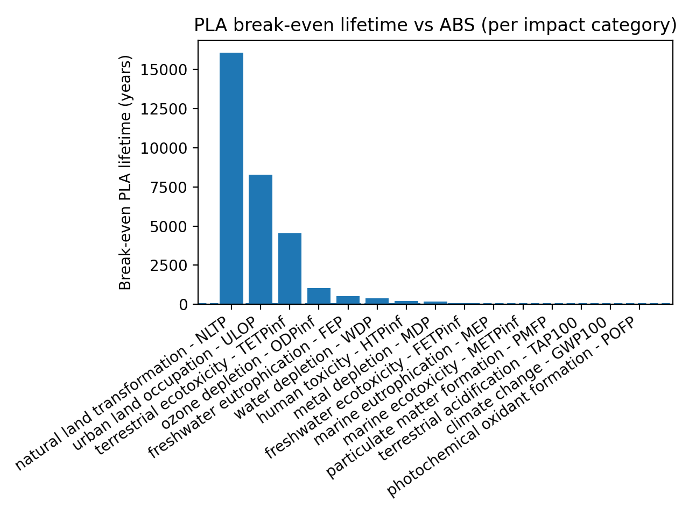

# openlca-results-analyzer

Python-based analysis framework for post-processing openLCA Excel exports.
The tool automates durability-based functional unit scaling (Durability Multiplier),
PLA lifetime sensitivity (6–15 years), and break-even lifetime analysis to
support material selection under environmental performance constraints.

## Example results

### Climate change (GWP100)


### Fossil depletion (FDP)


### Human toxicity (HTPinf)


## What it does
- Reads openLCA Excel exports (ABS / PP / PLA)
- Normalizes impact results into a master table
- Applies Durability Multiplier (DM = 15 / L_PLA)
- Exports reproducible sensitivity outputs (L_PLA = 6, 10, 15)

## Inputs
Place these files in `data/raw/`:
- Door_panel___ABS__foreground_.xlsx
- Door_panel___PP__foreground_.xlsx
- Door_panel___PLA__foreground_.xlsx

## How to run
```bash
pip install pandas openpyxl matplotlib jinja2
python -m src.build_master
python -m src.reproduce_dm
## Break-even analysis (PLA vs ABS)

The tool computes the minimum PLA lifetime required to match ABS impacts under durability scaling.
Output: `data/processed/PLA_break_even_vs_ABS.csv`
## Break-even visualization (PLA vs ABS)

